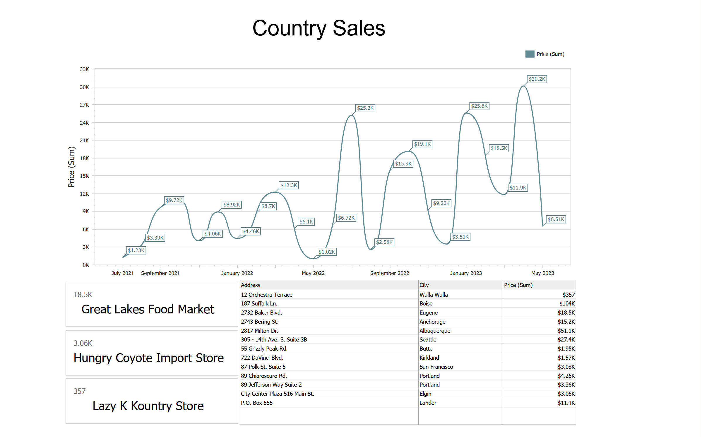

<!-- default badges list -->

[](https://docs.devexpress.com/GeneralInformation/403183)
[](#does-this-example-address-your-development-requirementsobjectives)
<!-- default badges end -->

# DevExpress VCL Dashboards — Generate Dashboards in a Backend / Service Application

This example uses DevExpress Dashboards for Delphi/C++Builder to generate dashboards in a command line application.
The application accepts a country name parameter, queries the database for country sales data,
and exports a "sales" dashboard as a PDF file.

This example bypasses the DevExpress Dashboard Viewer dialog and generates a dashboard
using the DevExpress Dashboards backend.
Use the approach demonstrated in this sample project to implement
Web API backends, Windows Services, workflows, and scheduled jobs.
This approach can be particularly beneficial for the following usage scenarios
(reports generated without direct user interaction):

-   Mass-export dashboards to PDF, DOCX, image, and other formats.
-   Share, email, and print dashboard documents silently.
-   Implement custom dashboard management UIs.

---



---

## Prerequisites

[DevExpress Dashboards Prerequisites][req]

[req]: https://docs.devexpress.com/VCL/405773/ExpressCrossPlatformLibrary/vcl-backend/reports-dashboards-app-deployment#vcl-reportsdashboards-prerequisites

## Test the Example

1.  Open and build the Delphi project in the RAD Studio.
2.  Start a console session and navigate to the _Delphi_ project directory.
3.  Run the app and specify the country name:
    ```console
    > ConsoleDashboards.exe France

    Dashboard saved to: Sales_France.pdf
    ```
4.  Generate dashboards for other countries and compare generated PDF files.
 
The sample database shipped with the example includes sales data for
Argentina, Austria, Belgium, Brazil, Canada, Denmark, Finland, France,
Germany, Ireland, Italy, Mexico, Norway, Poland, Portugal, Spain,
Sweden, Switzerland, UK, USA, and Venezuela.

## Implementation Details

Follow the steps below to create an application that imports a dashboard layout from a file,
binds the layout to data, and exports the generated dashboard to a PDF file.


### Step 1: Initialize a Dashboard and Import a Dashboard Layout

An application requires a template dashboard layout previously created in the [Dashboard Designer][designer].
You can [import a layout from a file][file] or [load a layout from a database][database].
(Links refer to DevExpress VCL Reports examples that can be easily re-used with DevExpress Dashboards.)

[designer]: https://docs.devexpress.com/VCL/405774/ExpressDashboards/getting-started/create-dashboard-using-designer-dialog
[file]: https://github.com/DevExpress-Examples/vcl-reports-store-layout-template-file
[database]: https://github.com/DevExpress-Examples/vcl-reports-store-layout-template-database

This example imports a dashboard layout from the `CountrySalesDashboard.xml` file.

**Delphi:**
```delphi
ADashboard := TdxDashboard.Create(nil); // ADashboard: TdxDashboard;
try
    // Set an internal dashboard name (does not affect the exported content)
    ADashboard.Name := 'Country Sales';
    // Load the dashboard layout from the specified file
    ADashboard.Layout.LoadFromFile('CountrySalesDashboard.xml');
    // ...
finally
    ADashboard.Free;
end;
```


### Step 2: Create a Database Connection

Create a database connection component to supply data to the dashboard.
This example uses a SQL connection component with a built-in SQLite engine to load the Northwind sample database stored in `nwind.db`.

```delphi
// AConnection: TdxBackendDatabaseSQLConnection;
AConnection := TdxBackendDatabaseSQLConnection.Create(nil);
try
    // Assign a database name matching the name specified in the dashboard layout
    AConnection.DisplayName := 'NWindConnectionString';
    // Assign a connection string required to use the local SQLite database
    AConnection.ConnectionString := 'XpoProvider=SQLite; Data Source=nwind.db; Mode=ReadOnly';
    // ...
finally
    AConnection.Free;
end;
```

For detailed information on data source management and supported database engines, refer to the following help topic:
[VCL Backend: Supported Database Systems][dbms].

[dbms]: https://docs.devexpress.com/VCL/405703/ExpressCrossPlatformLibrary/vcl-backend/vcl-backend-supported-database-systems

### Step 3: Define Dashboard Parameter Values

A dashboard layout may include one or more parameters.
Parameters allow you to modify database queries and generate different dashboards
based on the same dashboard template and underlying data.
For example, `CountrySalesDashboard.xml` includes a single `CountryDashboardParameter` that filters data by country name.

To modify parameters, load them using the `LoadParametersFromDashboard` method
and assign values to `Dashboard.Parameters` list members as follows:

**Delphi:**
```delphi
ADashboard.LoadParametersFromDashboard;
// Set the "CountryDashboardParameter" value in the dashboard layout
ADashboard.Parameters['CountryDashboardParameter'].Value := ACountryName;
```


### Step 4: Export Dashboard Content to a File

This example exports a dashboard to a PDF file:

**Delphi:**
```delphi
AStream := TMemoryStream.Create; // AStream: TMemoryStream;
try
    // Export a dashboard to a memory stream in the PDF format
    ADashboard.ExportTo(TdxDashboardExportFormat.PDF, AStream);
    // Save memory stream content to a file
    AStream.SaveToFile('Sales_' + ACountryName + '.pdf');
finally
    AStream.Free;
end;
```

### Export Multiple Dashboards

The approach outlined in this example allows you to generate and export multiple dashboards based on the same layout and data
using a list of parameters.
You need to initialize the dashboard layout and data connection once (steps 1 and 2)
and repeat steps 3 and 4 for each parameter.

**Delphi:**
```delphi
// ...
ADashboard.LoadParametersFromDashboard;

for ACountryName in ACountryNameList:
    ADashboard.Parameters['CountryDashboardParameter'].Value := ACountryName;

    AStream := TMemoryStream.Create; // AStream: TMemoryStream;
    try
        // Export a dashboard to a memory stream in the PDF format
        ADashboard.ExportTo(TdxDashboardExportFormat.PDF, AStream);
        // Save memory stream content to a file
        AStream.SaveToFile('Sales_' + ACountryName + '.pdf');
    finally
        AStream.Free;
    end;
end;
```


## Files to Review

-   [`Delphi/ConsoleDashboards.dpr`](./Delphi/ConsoleDashboards.dpr) generates a dashboard in non-interactive (headless) mode.
-   [`CountrySalesDashboard.xml`](./CountrySalesDashboard.xml) contains a dashboard layout designed to generate a country sales dashboard.
    You can open the same dashboard in the Dashboard Designer and Viewer using the [dashboard with a hidden parameter example application][example].
-   [`nwind.db`](./nwind.db) contains the Northwind sample database.

[example]: https://github.com/DevExpress-Examples/vcl-dashboards-pass-hidden-parameters-to-custom-sql-query

## Documentation and Examples

-   [Introduction to VCL Dashboards](https://docs.devexpress.com/VCL/405642/ExpressDashboards/vcl-dashboards)
-   [Tutorial: Create a dashboard using the Designer Dialog](https://docs.devexpress.com/VCL/405774/ExpressDashboards/getting-started/create-dashboard-using-designer-dialog)
-   [How to store layouts in XML files (example application)](https://github.com/DevExpress-Examples/vcl-reports-store-layout-template-file)
-   [How to store layouts in a database (example application)](https://github.com/DevExpress-Examples/vcl-reports-store-layout-template-database)
-   [How to use SQLite as a data source for dashboards (as demonstrated in the current example)](https://docs.devexpress.com/VCL/405750/ExpressCrossPlatformLibrary/vcl-backend/database-engines/vcl-backend-sqlite-support)
-   [API reference: `TdxDashboard` class](https://docs.devexpress.com/VCL/dxDashboard.TdxDashboard)
-   [API reference: `TdxDashboard.Layout` property](https://docs.devexpress.com/VCL/dxDashboard.TdxDashboard.Layout)
-   [API reference: `TdxBackendDatabaseSQLConnection` component](https://docs.devexpress.com/VCL/dxBackend.ConnectionString.SQL.TdxBackendDatabaseSQLConnection)


<!-- feedback -->
## Does This Example Address Your Development Requirements/Objectives?

[](https://www.devexpress.com/support/examples/survey.xml?utm_source=github&utm_campaign=vcl-dashboards-non-interactive-export&~~~was_helpful=yes) [](https://www.devexpress.com/support/examples/survey.xml?utm_source=github&utm_campaign=vcl-dashboards-non-interactive-export&~~~was_helpful=no)

(you will be redirected to DevExpress.com to submit your response)
<!-- feedback end -->
